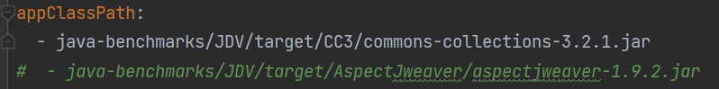
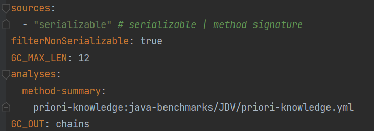
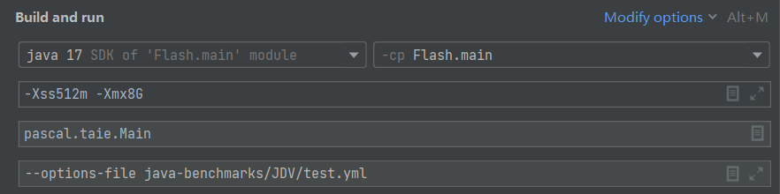

## Flash

Flash is a gadget chain detection tool towards efficient and precise call graph construction based on DDCA (Deserialization-Driven Controllability Analysis). The tool is built upon [Tai-e](https://github.com/pascal-lab/Tai-e).

### How Flash works

#### Demand-Driven Points-To Analysis

DDCA is a novel demand-driven pointer analysis we develop to analysis the controllability of variables specific to deserialization scenario. To learn more about demand-driven pointer analysis, you can read the papers below :

- Heintze N, Tardieu O. Demand-driven pointer analysis[J]. ACM SIGPLAN Notices, 2001, 36(5): 24-34.
- Sridharan M, Gopan D, Shan L, et al. Demand-driven points-to analysis for Java[J]. ACM SIGPLAN Notices, 2005, 40(10): 59-76.
- Shang L, Xie X, Xue J. On-demand dynamic summary-based points-to analysis[C]//Proceedings of the Tenth International Symposium on Code Generation and Optimization. 2012: 264-274.
- ......

Here we list some key technical points :

- We use strings to represent controllability instead of numbers (GadgetInspector, Tabby), which helps us do reflection analysis
- For `transient` variables, inspired by the `classInitializer` of Tai-e, we first analyze the deserialization related methods of the class before analyzing a method to simulate the semantics and restore the controllability.
- We consider call site variables and method summaries variables as in demand.
- The queried results are cached and dynamic updated (as a cached pointer may have new source edge) to speed up.

#### Hybrid Method Dispatch

Flash resolves callees based on the controllability of receiver variable.

- Controllable -> refined CHA
    - Serializable
    - Visibility
    - Subtype
- New -> PA

#### Advanced Dynamic Feature Analysis

For Reflection, inspired by the studies below, we use a controllable string and JavaBean analysis (model related APIs) to infer and filter targets :

- Song X, Wang Y, Cheng X, et al. Efficiently Trimming the Fat: Streamlining Software Dependencies with Java Reflection and Dependency Analysis[C]//Proceedings of the IEEE/ACM 46th International Conference on Software Engineering. 2024: 1-12.
- https://github.com/mbechler/marshalsec/blob/master/marshalsec.pdf
- Li Y, Tan T, Sui Y, et al. Self-inferencing reflection resolution for Java[C]//ECOOP 2014–Object-Oriented Programming: 28th European Conference, Uppsala, Sweden, July 28–August 1, 2014. Proceedings 28. Springer Berlin Heidelberg, 2014: 27-53.

To see the summaries, please refer to [priori-knowledge file](https://github.com/AnnoymousRep/Flash/blob/main/java-benchmarks/JDV/test.yml) :

- Controllable String -> String, StringBuilder, StringBuffer
- Controllable JavaBean -> PropertyDescriptor, Introspector

For Dynamic Proxy usage in exploitation, we collect a set of features that a call site should meet :

- Implement Presence
- Interface Call
- No Cast

### How to Use Flash

Before using Flash, make sure you know [how to use Tai-e](https://tai-e.pascal-lab.net/docs/current/reference/en/index-single.html).

#### Analysis Target

Just specific the `appClassPath` in the analysis configuration file. You can analyze multiple jars at the same time. 

#### Params

- sources : `serializable`  (all deserialization-related methods, such as `readObject`, `readExternal`) or `method signature`
- filterNonSerializable : `true` or `false`, filter methods that their declaring classes not implement `java.io.Serializable`
- GC_MAX_LEN : the max length of a gadget chan that Flash will search
- GC_OUT : output file of gadget chains
- priori-knowledge : the file which contains manually created summaries for methods

Here is an example we provide :

#### Run

~~~
-Xss512m -Xmx8G
--options-file java-benchmarks/JDV/test.yml
~~~

#### Filter Results

As noted in the paper, the results can be a large number, so we recommend you filter the results based on our source-sink pair strategy by following scripts :

- key_filter.py : you can find a keyword that the library holds (i.e., `commons` in CommonsCollection3) to filter the unwanted results like the gadget chains totally composed of JDK classes.
- ss_filter.py : source is usually the first gadget. However, you can specific the sink (or default, the last gadget) to do the filter.

### The Results of Flash

For the results in paper, please refer to Flash_GC.

If you find a new Gadget Chain with Flash, we are very glad to see your PR :)
